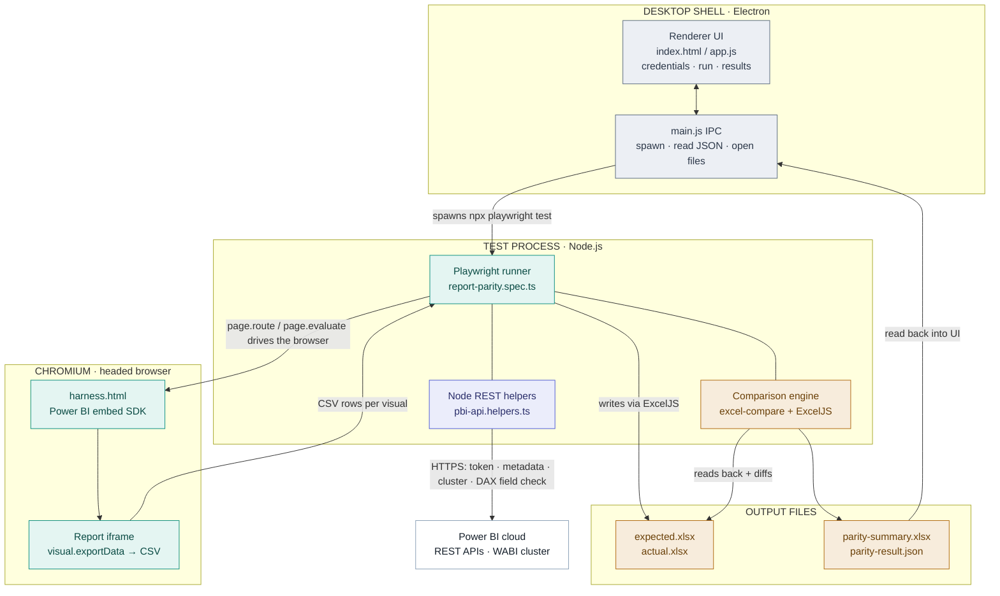

# Cygnus Report Parity Validator — Architecture

How the tool proves an Import-mode Power BI report and its migrated Direct-Lake
twin show the same numbers — and exactly which technology owns each step.

> **In one line:** Playwright extracts the truth from the live report;
> everything downstream turns that into a verdict.

---

## End-to-end flow

**Layer legend:** &nbsp; ⬜ Desktop shell &nbsp;·&nbsp; 🟦 Node REST layer &nbsp;·&nbsp; 🟩 Playwright & browser &nbsp;·&nbsp; 🟧 Excel & comparison

---

## The run, phase by phase

| # | Owner | What happens |
|---|-------|--------------|
| **1** | `Electron` | The user enters report identity and clicks **Run Parity**. The desktop shell spawns the Playwright test process with `npx playwright test` and streams its log back to the window. |
| **2** | `Playwright` | Launches a real **headed Chromium** and loads the saved sign-in session (`cygnus.user.json`) so Power BI treats it as the logged-in user — no password is typed at run time. |
| **3** | `Node REST` | Node-side helpers call Power BI directly over HTTPS for the **access token, report metadata, backend cluster, and a DAX probe** that confirms each filter field actually exists in *both* datasets — done in Node because the browser is blocked by CORS. |
| **4** | `Playwright` | Serves `harness.html` into the browser via `page.route` and intercepts the cluster-resolution call, proxying it through Node. The **Power BI embed SDK** then renders the report in an iframe. |
| **5** | `Playwright` | For each page, applies the chosen slicer/filter selections, then calls `visual.exportData()` inside the browser via `page.evaluate`. Every visual returns its data as **CSV**. |
| **6** | `Node` | Node parses the CSV and **ExcelJS** streams it to workbooks — the Import-mode source becomes `expected.xlsx`, the Direct-Lake target becomes `actual.xlsx`. |
| **7** | `Comparison` | The comparison engine reads both workbooks back, **pairs pages and visuals** (tolerant of case, spacing, and dropped accents), diffs every value, and grades each difference safe / review / critical. |
| **8** | `Output` + `Electron` | Results are written as `parity-summary.xlsx` plus a machine-readable `parity-result.json`. The desktop shell reads the JSON back and renders the **verdict, narrative, and per-page breakdown** right in the window. |

---

## Who does what

| Technology | Role |
|------------|------|
| **Playwright** | **Browser automation & data-extraction driver.** Launches Chromium, restores the login session, serves the harness, intercepts/proxies network calls, navigates report pages, applies filters, and pulls each visual's data out. The engine that *gets the numbers*. |
| **Chromium + Embed SDK** | The real browser and Microsoft's **powerbi-client** SDK that actually render the report. `harness.html` hosts the embed and exposes the `__exportPageVisuals()` hooks Playwright calls. |
| **Node.js REST helpers** | Server-side HTTPS calls to **Power BI & Azure AD** for tokens, report metadata, cluster routing, and DAX field validation — the calls a browser can't make because of CORS. |
| **ExcelJS** | Streams the extracted CSV into **.xlsx workbooks** and reads them back for comparison. One sheet per report page. |
| **Comparison engine** | Pairs pages/visuals across the two reports, **diffs every cell**, classifies severity, and produces both the human summary and the JSON the UI reads. |
| **Electron shell** | The desktop window: collects report identity, **spawns the test process**, streams its log, reads the result JSON, and opens the output files. *(The layer currently slated for redesign.)* |

---

## Playwright's role, precisely

> **Playwright is the driver, not the judge.**

Power BI has no API that returns "the rendered numbers a user sees on this page."
The only faithful way to get them is to **open the report in a real browser,
exactly as a person would, and read the data back out of each visual**. That is
the job Playwright exists to do here — it automates a genuine Chromium session
end to end.

### What Playwright owns

- Launching real Chromium & restoring the sign-in session
- Serving `harness.html` and intercepting/proxying network calls
- Navigating pages and applying slicer & filter selections
- Calling `visual.exportData()` and collecting every visual's CSV
- Waiting for the report to actually finish rendering

### What Playwright does **not** do

- Comparing the two reports — that's the comparison engine
- Deciding pass / fail or severity — that's the analysis step
- Talking to Power BI REST APIs — that's the Node helpers
- Writing or reading the Excel files — that's ExcelJS
- Drawing the desktop UI — that's the shell

---

## Key source files

| Concern | File |
|---------|------|
| Run orchestration | `tests/specs/report-parity.spec.ts` |
| Browser automation + visual extraction | `tests/helpers/harness.helpers.ts` |
| In-browser embed & export hooks | `harness/harness.html` |
| Power BI / Azure AD REST calls | `tests/helpers/pbi-api.helpers.ts` |
| Workbook write/read + diffing | `tests/helpers/excel-compare.helpers.ts` |
| Export + summary/analysis builders | `tests/helpers/report-export.helpers.ts` |
| Filter/slicer discovery & matching | `tests/helpers/slicer-config.helpers.ts`, `tests/helpers/cross-report-match.helpers.ts` |
| Desktop shell (spawn, read-back, file open) | `app-desktop/main.js`, `app-desktop/preload.js`, `app-desktop/renderer/` |

---

*Import mode (source) → `expected.xlsx` · Direct Lake (target) → `actual.xlsx` · diff → `parity-summary`*
